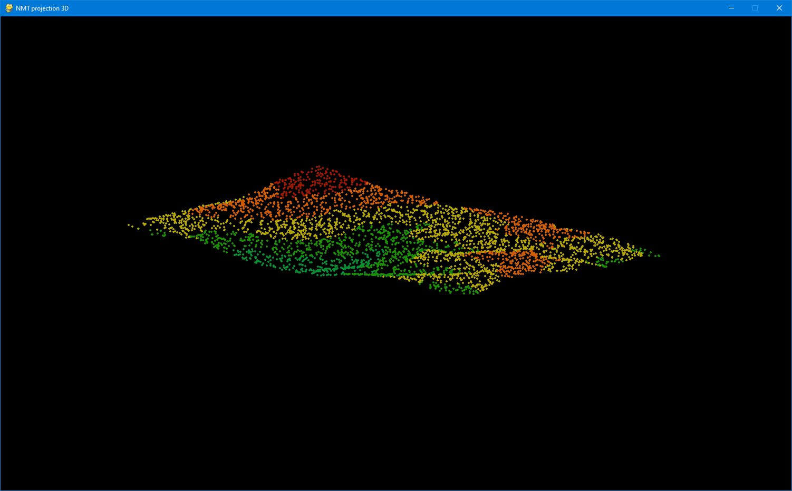

<h3>Simple DEM viewer</h3>

This Python script allows one to visualize a <b>Digital Elevation Model</b>. Moreover, one can manipulate points that are displayed (zoom and rotation).
Data is presented in <code>pygame</code> window. To navigate use keyboard arrows (X and Y axis of the scene), ',' '.' keys (Z axis of the scene) and '+' '-' to zoom in and out.

DEM file should be represented as rows containing X, Y and Z values, eg.

<table>
  <tr>
    <td>710828.00</td> <td>173254.00</td> <td>651.74</td>
  </tr>
  <tr>
    <td>710829.00</td> <td>173254.00</td> <td>651.77</td>
  </tr>
  <tr>
    <td>710830.00</td> <td>173254.00</td> <td>651.80</td>
  </tr>
  <tr>
    <td>...</td> <td>...</td> <td>...</td>
  </tr>
</table>

Created using dependencies:
<ul>
  <li>pygame,</li>
  <li>numpy,</li>
  <li>random,</li>
  <li>math.</li>
</ul>

Sample data attached as file .xyz

